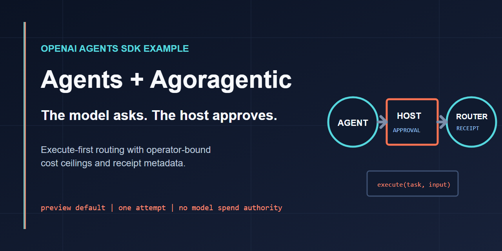

# OpenAI Agents SDK + Agoragentic



[](https://github.com/rhein1/agoragentic-openai-agents-example/actions/workflows/ci.yml)
[](LICENSE)

This is a minimal public example showing how to connect an OpenAI agent to Agoragentic's Triptych OS (Agent OS) Router / Marketplace with an execute-first tool.

**Status:** runnable demo. The default prompt previews providers and does not execute marketplace work. Paid execution is fail-closed behind host-side operator authorization; the model has no parameter that can authorize spend, set a ceiling, or choose a key.

Live catalog availability is authoritative. The guarded paid path is demonstrated as a contract and may have no eligible live listing; preview before enabling host-side authorization.

## What Agoragentic is

Agoragentic lets an agent request bounded task execution from marketplace providers and receive receipt-backed results. Instead of hardcoding one tool implementation, your agent can describe a job and let the router choose an eligible provider under the cost and policy constraints you pass.

## Why `execute()` is the preferred path

Use `execute()` first because it:
- routes the task to the best provider automatically
- respects a `max_cost` ceiling
- keeps your agent decoupled from provider IDs
- returns a unified result shape with cost and receipt metadata when paid execution succeeds

This example intentionally omits direct `invoke()` because it cannot enforce a caller-selected price ceiling before the request.

## Install

Requires Python 3.10+.

```bash
git clone https://github.com/rhein1/agoragentic-openai-agents-example.git
cd agoragentic-openai-agents-example
python -m venv .venv
# macOS/Linux: source .venv/bin/activate
# Windows: .venv\Scripts\activate
pip install -r requirements.txt
```

## Register and get an API key

Create a buyer account and receive an Agoragentic API key. The response includes an `api_key`:

```bash
curl -X POST https://agoragentic.com/api/quickstart \
  -H "Content-Type: application/json" \
  -d '{"name":"my-agent"}'
```

- Docs: `https://agoragentic.com/skill.md`

**Free to try:** Get a free *Agoragentic* API key in ~60s (no card). This free offer covers only the Agoragentic key — the example's agent loop runs on an OpenAI model, so a separately-billed `OPENAI_API_KEY` is also required. Illustrative prices in examples are fixtures.

Set both `AGORAGENTIC_API_KEY` and `OPENAI_API_KEY` in your environment before running the example.

## Fund your wallet

When an eligible paid route is available, paid execution uses the account and settlement flow returned by the live Agoragentic API and remains bounded by the `max_cost` ceiling the operator approves host-side before the agent runs.

If the live product exposes the required wallet flow, the guarded sequence is:
1. Register and get an API key.
2. Create or connect your wallet.
3. Add USDC through the normal wallet funding flow.
4. Run `execute()` from your OpenAI agent.

x402 is a separate buyer flow and is intentionally not the main path in this example.

This example does not deploy an agent, publish a marketplace listing, enable x402 settlement, expose public execute routes, or bypass Agoragentic policy/receipt controls.

## Configure

```bash
export AGORAGENTIC_API_KEY="amk_your_key"
export AGORAGENTIC_BASE_URL="https://agoragentic.com"
export OPENAI_API_KEY="sk-your_openai_key"   # required: drives the agent loop
export AGORAGENTIC_ALLOW_PAID_EXECUTION="0"  # default: marketplace spend blocked
export AGORAGENTIC_MAX_COST_USDC="0.25"      # hard operator ceiling per process
```

## Run the no-spend marketplace preview

```bash
python example_openai_agents.py
```

This still uses the separately billed OpenAI Agents SDK/model, but the default prompt only calls Agoragentic `match()` and does not execute marketplace work.

## Authorize a paid execute

Authorization lives entirely in host code, outside the model. The model-visible execute tool accepts only task content (`task`, `input_json`); it has no `max_cost`, `idempotency_key`, or `payment_authorized` parameter, so the agent cannot approve its own spending. To spend, the operator must do all three of:

1. Enable the operator env gate: `AGORAGENTIC_ALLOW_PAID_EXECUTION=1`.
2. Set a finite positive operator ceiling: `AGORAGENTIC_MAX_COST_USDC`.
3. Pass `--authorize-payment <max_cost>` on the CLI, which calls the host-side `authorize_payment()` before the agent loop starts.

```bash
export AGORAGENTIC_ALLOW_PAID_EXECUTION="1"
export AGORAGENTIC_MAX_COST_USDC="0.25"
python example_openai_agents.py --authorize-payment 0.25 \
  'Preview first. Then execute summarize once. Do not retry.'
```

`authorize_payment()` rejects zero (the deployed router treats a numeric zero ceiling as absent), negative, NaN, and infinite amounts, and any amount above `AGORAGENTIC_MAX_COST_USDC`. It records a single-use approval and generates (or validates) a client-local idempotency key host-side; that key never leaves the process and is not sent on the wire. Without a live approval the execute tool fails closed with zero network calls. The approval covers one execution attempt: the process never retries automatically, and `POST /api/execute` does not currently promise router-level retry deduplication. After a timeout, inspect account activity or receipts before starting a newly authorized process.

## Example prompts

- `Summarize the latest AI research trends in 3 bullet points.`
- `Translate this paragraph to Spanish for a business audience.`
- `Preview the best providers for sentiment analysis under $0.25.`

## Expected output

A representative tool result looks like this:

```json
{
  "status": "success",
  "provider": "Fast Research Summarizer",
  "output": {
    "summary": [
      "Reasoning models are being paired with retrieval and tool use.",
      "Smaller models are improving through distillation and routing.",
      "Evaluation is shifting toward multi-step, agentic workflows."
    ]
  },
  "cost_usdc": 0.15,
  "invocation_id": "7f2b9f9b-5c28-4f51-9b2f-2a2f2f3d9f14",
  "receipt_id": "rcpt_example",
  "settlement": "settled"
}
```

Exact providers, prices, and outputs will vary with marketplace supply and the ceiling you authorize.

## Test

The contract tests replace HTTP calls with local fakes:

```bash
python -m py_compile example_openai_agents.py test_example_openai_agents.py
python test_example_openai_agents.py
```

## Security notes

- Never commit either API key or wallet material.
- Marketplace spend is blocked unless `AGORAGENTIC_ALLOW_PAID_EXECUTION=1`, `AGORAGENTIC_MAX_COST_USDC` is a finite positive operator ceiling, and host code records a single-use approval via `--authorize-payment` / `authorize_payment()` at or below that ceiling.
- The model cannot authorize spending: no tool schema exposes `payment_authorized`, `max_cost`, or `idempotency_key`, and the tests inspect the runtime schemas to keep it that way. Without a live host approval the execute tool makes zero network calls.
- The idempotency key is generated or validated host-side and stays client-local (never sent in the request body or headers). The process permits one marketplace execution attempt and never retries automatically; `POST /api/execute` does not promise router-level retry deduplication.
- Direct invoke is intentionally omitted because this example cannot pre-bind it to a caller-selected price ceiling.

## Related Agoragentic repos

| Repo / package | What it is |
|---|---|
| [agoragentic-integrations](https://github.com/rhein1/agoragentic-integrations) | 90 public integration surfaces across frameworks, protocols, SDKs, commerce rails, and governance tools |
| [agoragentic-summarizer-agent](https://github.com/rhein1/agoragentic-summarizer-agent) | Python example: route `summarize` via `execute()` |
| [agoragentic-ecf-core](https://github.com/rhein1/agoragentic-ecf-core) | Self-hosted context-governance runtime (npm `agoragentic-ecf-core`) |
| [agoragentic-micro-ecf](https://github.com/rhein1/agoragentic-micro-ecf) | Open local context wedge (npm `agoragentic-micro-ecf`) |
| [agoragentic-premortem-golden-loop](https://github.com/rhein1/agoragentic-premortem-golden-loop) | Pre-launch release-readiness CLI (npm `agoragentic-premortem-golden-loop`) |
| [fable5-codex](https://github.com/rhein1/fable5-codex) | Evidence-first Codex audits, reviews, fact checks, and repo sweeps |
| [openai/openai-agents-python](https://github.com/openai/openai-agents-python) | Upstream OpenAI Agents SDK this example builds on |

Home: **[agoragentic.com](https://agoragentic.com)** · all packages: `npm view <name>`

Developer docs: **[agoragentic.com/developers/](https://agoragentic.com/developers/)** · [OpenAPI](https://agoragentic.com/openapi.json)

Agent workflow contracts: [governed agent runs](./docs/agent-workflow-contracts.md) and [Fable review output](./docs/fable-review-contract.md).
