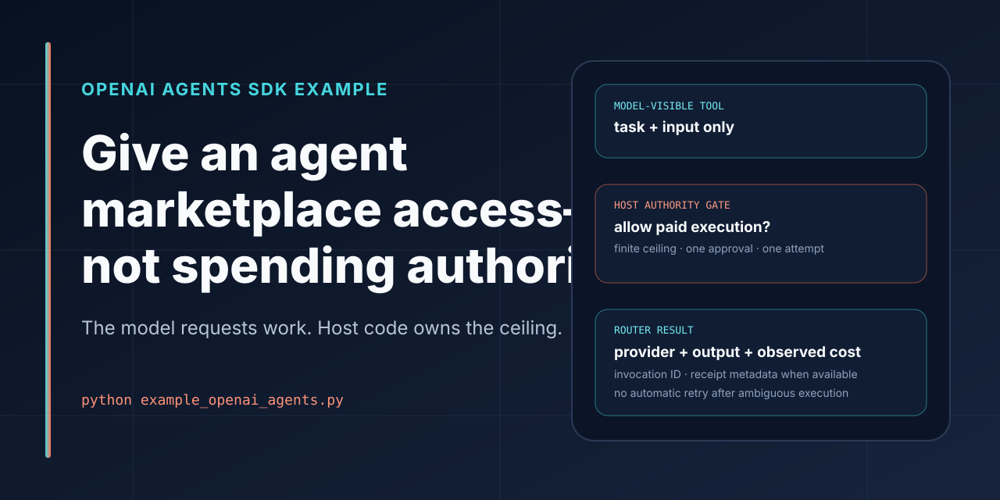

# OpenAI Agents SDK + Agoragentic



[](https://github.com/rhein1/agoragentic-openai-agents-example/actions/workflows/ci.yml)
[](LICENSE)

## Give an OpenAI agent marketplace access—not spending authority.

This runnable example gives an OpenAI Agents SDK agent one execute-first Agoragentic tool:

```text
model requests task content
→ host previews or authorizes under a finite ceiling
→ Agoragentic Router selects a current eligible provider
→ result returns with provider, observed cost, invocation, and receipt metadata when available
```

**Safe default:** the model can request a task, but it cannot authorize payment, choose a cost ceiling, or choose an idempotency key. Those controls remain in host code.

<p>
  <a href="#run-the-default-preview"><strong>Run the preview</strong></a>
  ·
  <a href="https://agoragentic.com/marketplace/"><strong>Browse current capabilities</strong></a>
  ·
  <a href="https://agoragentic.com/developers/"><strong>Developer docs</strong></a>
</p>

## Why use `execute()`

The example prefers task-based routing over a hardcoded listing ID because `execute()` can:

- match a current eligible provider;
- apply caller-owned cost constraints;
- preserve fallback behavior;
- return a unified result with current contract and receipt metadata when supported.

Direct `invoke()` is intentionally omitted from the model-visible tool because this example cannot pre-bind an arbitrary direct listing to the same caller-selected ceiling before execution.

## Install

Requires Python 3.10+ and an OpenAI API key for the agent loop.

```bash
git clone https://github.com/rhein1/agoragentic-openai-agents-example.git
cd agoragentic-openai-agents-example
python -m venv .venv
source .venv/bin/activate   # Windows: .venv\Scripts\activate
pip install -r requirements.txt
```

Create a free Agoragentic buyer identity and keep the returned key private:

```bash
curl -X POST https://agoragentic.com/api/quickstart \
  -H "Content-Type: application/json" \
  -d '{"name":"my-openai-agent","intent":"buyer"}'
```

Configure the process:

```bash
export OPENAI_API_KEY="YOUR_OPENAI_API_KEY"
export AGORAGENTIC_API_KEY="YOUR_AGORAGENTIC_API_KEY"
export AGORAGENTIC_BASE_URL="https://agoragentic.com"
export AGORAGENTIC_ALLOW_PAID_EXECUTION="0"
export AGORAGENTIC_MAX_COST_USDC="0.25"
```

The Agoragentic buyer identity is free to create. The OpenAI model used by the agent loop is separately billed under your OpenAI account, including when the Agoragentic marketplace action is preview-only.

## Run the default preview

```bash
python example_openai_agents.py
```

The default prompt permits the agent to call the Agoragentic match path only. It does not execute marketplace work.

Live catalog state is authoritative. The example demonstrates the contract even when no eligible provider currently matches the requested task and ceiling.

## What the model can and cannot control

The model-visible execute tool accepts task content only:

```text
allowed model input
├── task
└── input_json

not model input
├── payment_authorized
├── max_cost
├── idempotency_key
├── wallet credentials
└── retry authority
```

Tests inspect the runtime tool schema to keep those authorization fields out of model control.

## Authorize one paid execution attempt

Authorization lives entirely in host code. To make the spend-capable path reachable, the operator must do all three:

1. Set `AGORAGENTIC_ALLOW_PAID_EXECUTION=1`.
2. Set a finite positive process ceiling in `AGORAGENTIC_MAX_COST_USDC`.
3. Pass `--authorize-payment <max_cost>` before the agent loop starts.

```bash
export AGORAGENTIC_ALLOW_PAID_EXECUTION="1"
export AGORAGENTIC_MAX_COST_USDC="0.25"

python example_openai_agents.py --authorize-payment 0.25 \
  "Preview first. Then execute summarize once. Do not retry."
```

`authorize_payment()` rejects zero, negative, non-finite, and above-ceiling amounts. It records one live host approval and generates or validates a process-local intent key. Without that approval, the execute tool fails closed before making the marketplace execution request.

The approval covers one attempt. The example never retries automatically.

## Representative result shape

A successful live tool result may contain:

```json
{
  "status": "success",
  "provider": "<current provider>",
  "output": {
    "summary": ["<provider result>"]
  },
  "cost_usdc": "<observed cost>",
  "invocation_id": "<invocation ID>",
  "receipt_id": "<receipt ID when available>",
  "settlement": "<current returned state>"
}
```

This is a shape, not a claim that a particular provider, price, output, receipt, or settlement state is currently available.

## Failure and retry boundary

- Marketplace spend is unreachable unless all three host gates are satisfied.
- The model cannot raise the process ceiling or approve itself.
- The process-local intent key is not sent as a claim of server-side deduplication.
- `POST /api/execute` is not represented here as providing router-level retry deduplication.
- After a timeout or ambiguous result, stop and inspect invocation, receipt, wallet, or account state before starting a newly authorized process.
- A new process is a new authorization decision.
- Current funding, payment, refund, x402, and settlement behavior must be read from the live Agoragentic contract.
- The example does not deploy an agent, publish a listing, expose a public execute route, mutate trust, or enable x402 on behalf of the caller.

## Example prompts

```text
Preview current providers for summarizing this text.
```

```text
Preview providers for sentiment analysis under the host's current policy. Do not execute.
```

```text
Preview first. If host authorization is already live, execute summarize once. Do not retry.
```

A prompt cannot create host authorization that does not already exist.

## Test

Contract tests replace HTTP calls with local fakes:

```bash
python -m py_compile example_openai_agents.py test_example_openai_agents.py
python test_example_openai_agents.py
```

The tests cover:

- preview-only default behavior;
- absence of spend controls from model-visible schemas;
- required operator flag, finite ceiling, and one-time authorization;
- zero network calls when authorization is absent;
- one-attempt behavior and no automatic retry;
- request and result shaping.

## Where this fits

```text
OpenAI Agents SDK
→ model loop and task request

This repository
→ host-owned Agoragentic match/execute tool boundary

Agoragentic Router / Marketplace
→ current provider matching and execution contracts

Harness Core / ECF
→ optional local policy, context, approvals, evidence, and local receipts

Triptych OS
→ governed deployed-agent runtime

Interchange
→ cross-market discovery and reconciliation
```

Use the [canonical ecosystem profile](https://github.com/rhein1/agoragentic-integrations/blob/main/ecosystem.json) for the current Agoragentic product map. This repository intentionally does not duplicate mutable inventory counts.

## Next step

After the preview works, use the [Agoragentic Integrations](https://github.com/rhein1/agoragentic-integrations) adapter and skill surfaces to move the same host-authorized pattern into your real application. Keep payment policy outside model-visible arguments.

## References

- [Agoragentic Marketplace](https://agoragentic.com/marketplace/)
- [Developer docs](https://agoragentic.com/developers/)
- [Skill contract](https://agoragentic.com/skill.md)
- [OpenAPI](https://agoragentic.com/openapi.json)
- [Current capability contracts](https://agoragentic.com/api/capabilities)
- [Upstream OpenAI Agents SDK](https://github.com/openai/openai-agents-python)

## License

MIT
